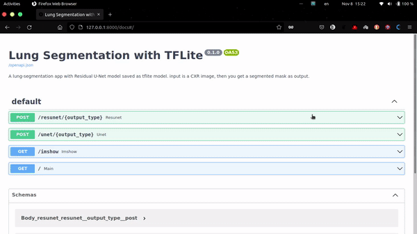

:::info summary

- An AI model for lung segmentation in CXR images, deploying with FastAPI.
- Use DVC for data version control, and dockerizing web-app.
- Deploy projects w/ K8s.
:::

This app uses `FastAPI` as backend. Check repository on [GitHub](https://github.com/pejmanS21/LS-Fastapi).

## Usage for `app.py`

First install required libraries by running:

```bash
pip install -r requirements.txt
```

To run the application run following command in `src` dir:

```bash
uvicorn app:app --reload
```

or

```bash
chmod +x app.sh
./app.sh
```

## Tutorial for `app.py`



## Tutorial

### `main page`

```
http://localhost:8000/
```


### `fastapi documentation`

```
http://localhost:8000/docs
```


### `show results`

```
http://localhost:8000/imshow
```


---

## DVC

```bash
pip install dvc dvc-gdrive

# pull weights from Google Drive
dvc pull
```

in [weights](./weights/) directory

```
weights
├── cxr_resunet.tflite
├── cxr_resunet.tflite.dvc
├── cxr_unet.tflite
└── cxr_unet.tflite.dvc
```

---

## Docker

```bash
# Build image
docker build -t IMAGE_NAME:TAG_NAME .
docker run -p 8000:8000 -d IMAGE_NAME:TAG_NAME
```

Or

```bash
# for amd64 systems
docker run -d -p 8000:8000 pejmans21/ls-fastapi:0.1.0

#### OR

# for arm64 systems
docker run -d -p 8000:8000 pejmans21/ls-fastapi:aarch64
```

---

## Kubernetes

```bash
kubectl apply -f ls-fastapi-k8s-config.yaml
```

to see output

```bash
kubectl port-forward service/lsapi-service 8000
```

> Now check http://127.0.0.1:8000/

### Stop process

```bash
kubectl delete -f ls-fastapi-k8s-config.yaml
```
