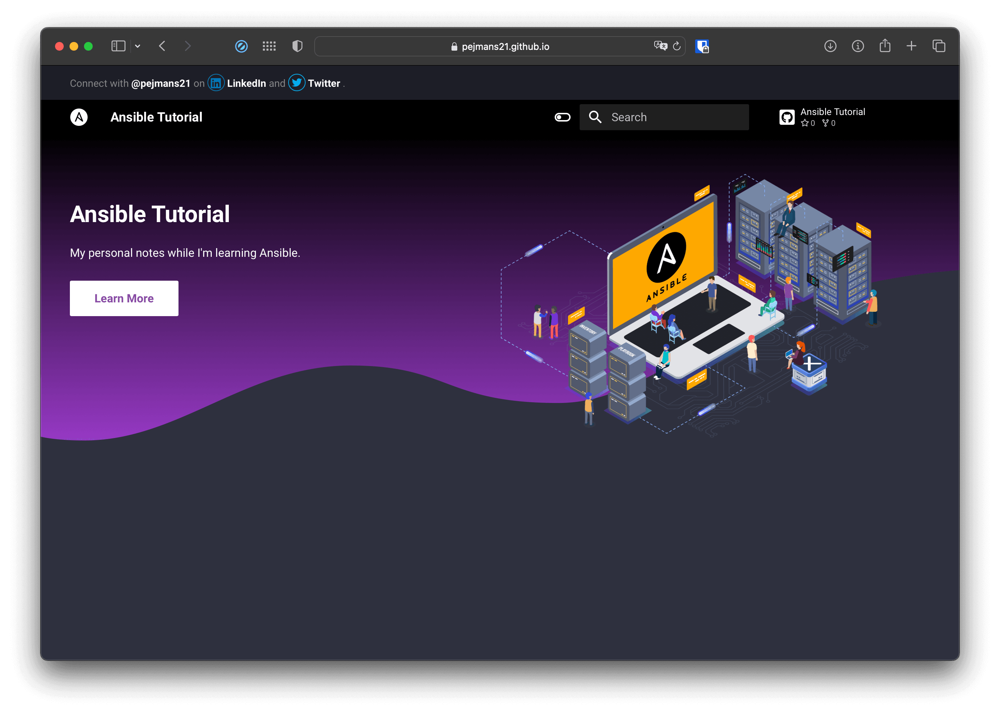

# Everything I Learned About Ansible: A Beginner’s Guide
If you’re new to Ansible, it can feel overwhelming at first. Whether you’re trying to automate your infrastructure, deploy applications, or manage configurations, Ansible has a lot to offer. But don’t let that scare you away. With a little knowledge and practice, you too can become proficient in using Ansible.
To help other beginners like myself, I’ve put together a repository on Github detailing everything I’ve learned about Ansible so far. In this blog post, I’ll summarize some of the key concepts and tips I’ve learned about this handy tool.
## Understanding Ansible
At its core, Ansible is an open-source IT automation tool created by Red Hat. According to their website, Ansible “provides a simple, yet powerful, automation engine for tackling complex workflows and orchestrating seamless deployments.”
The key advantage of Ansible is that it allows for automation without the need for special coding skills. With its simple YAML syntax, you can automate everything from deployment to configuration management to continuous delivery.
One important concept to understand when working with Ansible is that it uses a declarative approach to configuration management. This means that instead of specifying step-by-step instructions for tasks, you declare the state that you want your infrastructure to be in, and Ansible will take care of the details for you.
Ansible also uses a client-server architecture. The Ansible server (also known as the control machine) communicates with one or more Ansible clients (also known as managed nodes) to execute tasks. However, unlike other configuration management tools, Ansible does not require an agent to be installed on the client machines. Instead, it relies on SSH or WinRM protocols to establish a connection.
Getting Started with Ansible
To get started using Ansible, you’ll need to install it on your control machine. Ansible supports Linux, macOS, and Windows. Once you have Ansible installed, you can use it to execute tasks on one or more managed nodes.
A critical part of Ansible is understanding the inventory. The inventory is a file that specifies the managed nodes and groups of nodes that Ansible will target. The inventory can be a static file or generated dynamically from sources such as cloud providers, LDAP, or DNS.
One of the great features of Ansible is that it offers a large collection of pre-written tasks and modules called “Ansible Galaxy.” These modules can be easily installed and used in your playbook. Additionally, Ansible provides a powerful templating system (Jinja2) that allows you to personalize your task execution.

## Advanced Ansible Techniques
As you become more familiar with Ansible, you can start to take advantage of its more advanced features. Some of the ways you can level up your Ansible skills include:
- Using Ansible vault for encrypting sensitive data
- Creating custom modules for specific tasks
- Creating roles to group your tasks into reusable units
- Utilizing Ansible playbooks for orchestration and customization
- Creating dynamic inventories using APIs or other sources

## Conclusion
Ansible is a powerful automation tool that can help you streamline your infrastructure and configuration management. With its declarative syntax and client-server architecture, Ansible is easy to use and can scale to meet the demands of even the largest infrastructure. By reading through my Github repository and utilizing the tips and concepts outlined in this blog post, you’ll be well on your way to mastering Ansible.

