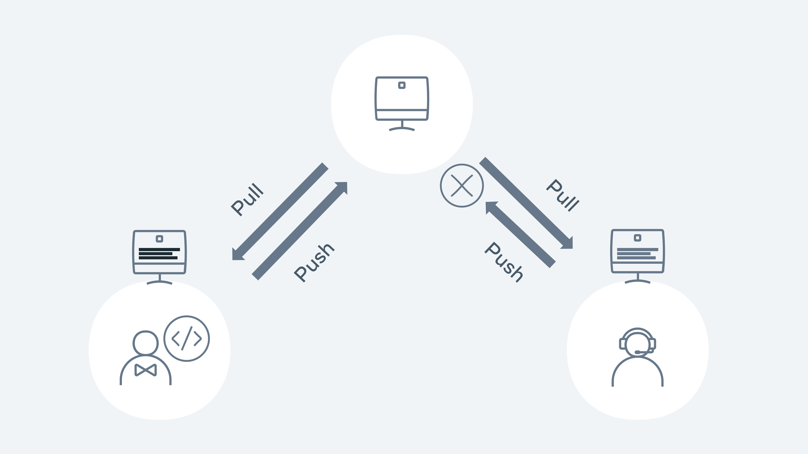

# Installing Git on Mac

Git works on all operating system platforms such as Windows, Mac, and Linux. On Mac or Linux, in some cases, it is installed by default. The majority of users will use Git via the command line as its syntax is very easy to understand and follow. Git also works well in development environments and integrates into IDEs and other GUI offerings.

Macs tend to have git installed by default, so before diving into the installation we can run a git version command to check if git is already installed. If the command returns a git version, then git is already installed. If it returns "command not found", git needs to be installed.

### Install with Xcode

Install the latest version of Xcode for your Mac by downloading it from the Apple Store or going to the official website - [https://developer.apple.com/xcode/](https://developer.apple.com/xcode/ "https://developer.apple.com/xcode/")

### Install Git from Homebrew

Homebrew is a popular package manager for Macs. It’s easy to use and makes it simple to install new packages such as git. First, you will need to install Homebrew on your machine. Go to the Homebrew website at [https://brew.sh/](https://brew.sh/ "https://brew.sh/") and follow the install instructions for Mac. Once Homebrew is installed, open a terminal window and then type the command brew install git

Once installed run the git version command to verify the installation is complete.

---

## Resolving conflicts

Conflicts will normally occur when you try to merge a branch that may have competing changes. Git will normally try to automatically merge (auto-merge), but in the case of a conflict it will need some confirmation, the competing changes need to be resolved by the end user. This process is called merging or rebasing.

The developer must look at the changes on the server and the changes on their local and validate which changes should be resolved.

A merge conflict example is when two developers are working on their own dependent branches. Both developers are working on the same file called Feature.js. Each of their tasks is to add a new feature to an existing method. Developer 1 has a branch called feature1 and developer 2 has a branch called feature2.

Developer 1 pushes the code with the changes to the remote repository. Developer 2 pushes their changes.



Demonstration of the push pull method

Let's walk through how this would happen in Git. Both developers 1 and 2 checkout the main repository on Monday morning. They both have the exact same copy. Both developers checkout a new branch - feature 1 and 2.

```bash
git pull
git checkout -b feature1
```

```bash
git pull
git checkout -b feature2
```

Developer 1 makes their changes to a file called Feature.js and then commits the changes to the repository for approval via a PR (pull request)

```bash
git add Feature.js
git commit -m 'chore: added feature 1!!'
git pull origin main
git push -u origin feature1
```

The PR is reviewed and then merged into the main branch. Meanwhile Developer 2 is starting to code on his feature. Again, they go through the same process as Developer 1:

```bash
git add Feature.js
git commit -m 'chore: added feature 2!!!'
git pull origin main
git add Feature.js
git commit -m 'chore: added feature 2!!!'
git pull origin main
```

```
From github.com:demo/demo-repo

 * branch            main       -> FETCH_HEAD

   9012934..d3b3cc0  main       -> origin/main

Auto-merging Feature.js

CONFLICT (content): Merge conflict in Feature.js

Automatic merge failed; fix conflicts and then commit the result.
```

Git lets us know that a merge conflict has occurred and needs to be fixed before it can be pushed to the remote repo. Running git status will also give us the same level of detail:

```bash
git status
```

```
On branch feature2

You have unmerged paths.

  (fix conflicts and run "git commit")

  (use "git merge --abort" to abort the merge)

Unmerged paths:

  (use "git add <file>..." to mark resolution)

        both modified:   Feature.js

no changes added to commit (use "git add" and/or "git commit -a")
```

In order to merge, Developer 2 needs to see and compare the changes from Developer 1. It is good practice to first see what branch is causing the merge issue. Developer 1 runs the following command:

```bash
git log --merge
```

```
commit 79bca730b68e5045b38b96bec35ad374f44fe4e3 (HEAD -> feature2)

Author: Developer 2 

<developer2@demo.com>

Date:   Sat Jan 29 16:55:40 2022 +0000

    chore: add feature 2

commit 678b0648107b7c53e90682f2eb8103c59f3cb0c0

Author: Developer 1 

<developer1@demo.com>

Date:   Sat Jan 29 16:53:40 2022 +0000

    chore: add feature 1
```

We can see from the above that the team conflicting changes occurred in feature 1 and 2 branches. Developer 1 now wants to see the change that is causing the conflict.

```bash
git diff

diff --cc Feature.js
```

```
index 1b1136f,c3be92f..0000000

--- a/Feature.js

+++ b/Feature.js

@@@ -1,4 -1,4 +1,8 @@@

  let add = (a, b) => {

++<<<<<<< HEAD

 +  if(a + b > 10) { return 'way too much'}

++=======

+   if(a + b > 10){ return 'too much' }

++>>>>>>> d3b3cc0d9b6b084eef3e0afe111adf9fe612898e

    return a + b;

  }
```

The only difference is the wording in the return statement. Developer 1 added 'too much' but Developer 2 added 'way too much. Everything else is identical so in terms of merging and it's a pretty easy fix. Git will show arrows <<< >>> to signify the changes. Developer 1 removes the markers so the code is ready for being submitted:

```
let add = (a, b) => {

  if(a + b > 10) { return 'way too much'}

  return a + b;

}
```

```bash
 git add Feature.js

 git commit -m 'fix merge conflicts'

 git push -u origin feature2
```

Developer 2 has now fixed a merge conflict and can create their PR to get the code merged into the main line.

---

#### diff commands

```bash
git diff HEAD README.md
git log --pretty=oneline
```

#### blame command

- Show history in line _5 to 15_ :

```bash
git blame -L 5,15 README.md
```

- Show history in _verbose_ format:

```bash
git blame -l README.md
```

- **_Output format_**

```
<ID><Author><Date><Time><Line number><Content>
```

---

## Forking

In previous lessons, you have touched on workflows such as branching and how they can be used to simplify a process for a team. Forking is another type of workflow. The key difference between branching and forking is that the workflow for forking creates a new repository entirely. Branching cuts a new branch from the same repository each time and each member of the team works on the single repository.

Let's take a simple example of how forking works. In the diagram below the coolgame repo has been forked by Joe. The entire contents and the history of the repository are now stored in Joe's account on GitHub. Joe is now free to make edits and changes to the repository at his own will. You, the owner of the coolgame repository can continue to work as normal and not know about Joe's edits or changes.

Joe created a new branch on his repository and added a new cool feature that he felt was needed. In order for Joe to get his feature back into the original repository, he will need to create a PR as normal but instead of comparing with the main branch, it needs to be compared with the original repository. Essentially the two repositories are compared against each other. The owner of the original repository can then review the PR and choose to accept of decline the new feature.

### Forking

Let us take a look at how you can fork an existing repository that is available on GitHub. For this example, let's fork the [forking lesson](https://github.com/Meta-Front-End-Developer-PC/forking-lesson "https://github.com/Meta-Front-End-Developer-PC/forking-lesson") repository.

**Step 1:** Go to [https://github.com/Meta-Front-End-Developer-PC/forking-lesson](https://github.com/Meta-Front-End-Developer-PC/forking-lesson "https://github.com/Meta-Front-End-Developer-PC/forking-lesson")

**Step 2:** Click on the Fork button on the top right of the page.

**Step 3:** It will then prompt you to fork the repository to your desired account. Choose the account you wish to fork to.

**Step 4:** Github will then clone the repository into your chosen GitHub account.

In a couple of steps, you have successfully forked a repository into our own GitHub account. The full repository is cloned and allows us to work directly in that repository as if it was our own.

On the landing page of the GitHub repository, it will show directly under the repository name that it was forked from Meta-Front-End-Developer-PC/forking-lesson.

Other subtle differences in the GitHub UI on a forked branch is the top information bar above the files.

It now shows that the branch is up to date with forking-lesson:main. It also adds a Fetch upstream drop-down to allow you to pull and merge the latest changes from the original repository.

### Example

Let's run through a typical flow of creating a new branch and adding some new content.

**Step 1:** Clone the repository.

**Step 2:** Create a new branch.

git checkout -b test/forking-example

**Step 4:** Create a new file and commit it to the repository.

touch text.txt git add . git commit -m 'chore: testing'

**Step 5** Push the branch to your remote repository.

git push -u origin test/forking-example

**Step 6:** Go to Github and click the Compare & pull request button. If it's not available, click on the branch dropdown button and change it from main to the branch name of test/forking-example:

After clicking the Compare & pull request button it will now redirect to the original repository in order to create the PR.

Each repository will have its own guidelines for submitting PRs against them and usually provide a how-to contribute guide. As you can see, in order to get the changes from our forked repository, you need to compare it against the original. This gives a lot of control to the repository owners of the original and they get to decide what makes the cut to be merged in.

In this lesson you covered the basics of forking a repository, adding some changes, and then creating a PR to get it back to the original repository.

---

## Additional Resources

**GitHub: Pricing**

GitHub is free to use, but it also offers different pricing models to suit the needs of different-sized teams and organizations. Check out the link below:

[https://github.com/pricing](https://github.com/pricing)

**Git: An Origin Story**

[https://www.linuxjournal.com/content/git-origin-story](https://www.linuxjournal.com/content/git-origin-story)

**Git Cheatsheet**

[https://education.github.com/git-cheat-sheet-education.pdf](https://education.github.com/git-cheat-sheet-education.pdf)

**Git patterns and anti-patterns for successful developers**

[https://youtu.be/t_4lLR6F_yk](https://youtu.be/t_4lLR6F_yk)

**Tech Talk: Linus Torvalds on git**

[https://www.youtube.com/watch?v=4XpnKHJAok8](https://www.youtube.com/watch?v=4XpnKHJAok8)

**Vim Cheatsheet**

[https://devhints.io/vim](https://devhints.io/vim)
